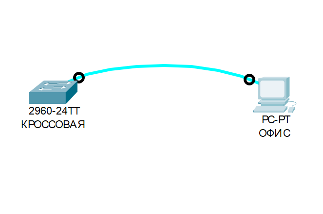

# ЛАБОРАТОРНАЯ РАБОТА.
## Базовая настройка коммутатора 

### Задание:
#### Часть 1. Проверка конфигурации коммутатора по умолчанию
   
#### Часть 2. Создание сети и настройка основных параметров устройства
   + Настройте базовые параметры коммутатора.
   + Настройте IP адресс для ПК

#### Часть 3. Проверка сетевых подключений
   + Отобразите конфигурацию устройства
   + Протестируйте сквозное соединение, отправив эхо-запрос
   + Протестируйте возможности удаленного управления с помощью Telnet

### Решение:

### Часть 1. Создание сети и проверка настроек коммутатора по умолчанию

#### ШАГ 1. Создаем сеть согласно топологии.

> Cоздаем топологию

> Устанавливаем консольное подключение к коммутатору при помощи эмулятора

> видим открывшийся пользовательский интерфейс
~~~
! Press RETURN to get started.

!Switch>
!Switch>
!Switch>
!Switch>
!Switch>
!Switch>
~~~

### Ответы на вопросы: 
   + Почему нужно использовать консольное подключение для первоначальной настройки коммутатора?

      **ОТВЕТ**: так как в коммутаторе еще нет конфигурации для других методов подключения

   + Почему нельзя подключиться к коммутатору через Telnet или SSH?

      **ОТВЕТ** так как коммутатор не иммет никаких конфигураций ( IP адреса, профилей доступа, паролей и удаленного доступа)

     
   #### ШАГ 2. Проверьте настройки коммутатора по умолчанию

Переходим из пользовательсокго режима в привелегированный режим командой - "enable" 

Вводим команду  "show running-config" для просмотра пустой конфигурации 

~~~
Switch>ena
Switch>enable 
Switch#
Switch#
Switch#
Switch#sh run
Switch#sh running-config 
Building configuration...

Current configuration : 1080 bytes
!
version 15.0
no service timestamps log datetime msec
no service timestamps debug datetime msec
no service password-encryption
!
hostname Switch
!
!
!
!
!
!
spanning-tree mode pvst
spanning-tree extend system-id
!
interface FastEthernet0/1
!
interface FastEthernet0/2
!
interface FastEthernet0/3
!
interface FastEthernet0/4
!
interface FastEthernet0/5
!
interface FastEthernet0/6
!
interface FastEthernet0/7
!
interface FastEthernet0/8
!
interface FastEthernet0/9
!
interface FastEthernet0/10
!
interface FastEthernet0/11
!
interface FastEthernet0/12
!
interface FastEthernet0/13
!
interface FastEthernet0/14
!
interface FastEthernet0/15
!
interface FastEthernet0/16
!
interface FastEthernet0/17
!
interface FastEthernet0/18
!
interface FastEthernet0/19
!
interface FastEthernet0/20
!
interface FastEthernet0/21
!
interface FastEthernet0/22
!
interface FastEthernet0/23
!
interface FastEthernet0/24
!
interface GigabitEthernet0/1
!
interface GigabitEthernet0/2
!
interface Vlan1
 no ip address
 shutdown
!
!
!
!
line con 0
!
line vty 0 4
 login
line vty 5 15
 login
!
!
!
!
end

Switch#
~~~

Как видим из конфигурации, настроенных IP адресов и паролей тут нет, все по умолчанию, поэтому выполнять очистку конфигурации нам не требуется

При изучении настоящей конфигурации мы видим, что коммутатор имеет 24 интерфейса FastEthernet и 2 интерфейса GigabitEthernet, а также 15 линий vty для удаленного подключения к коммутатору

